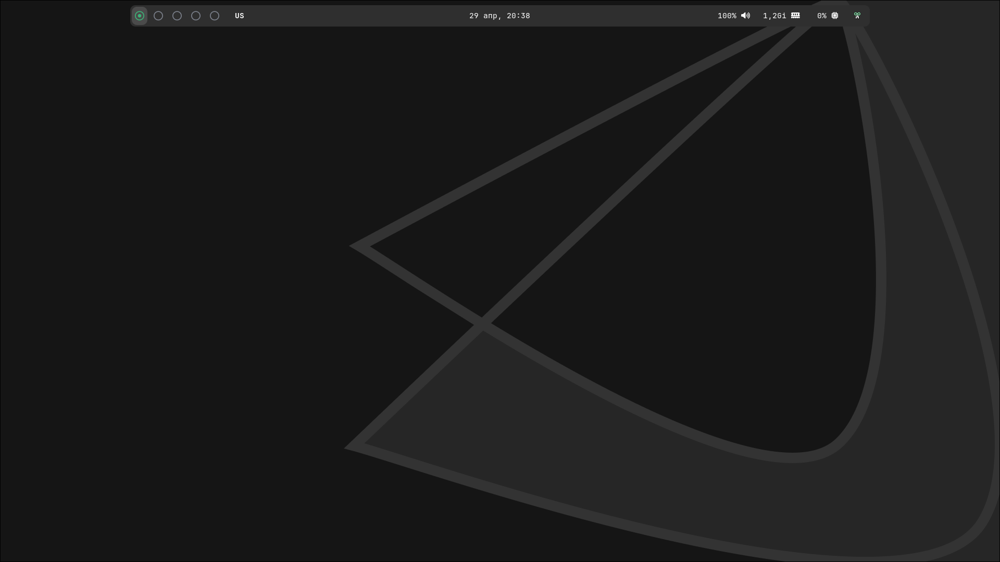
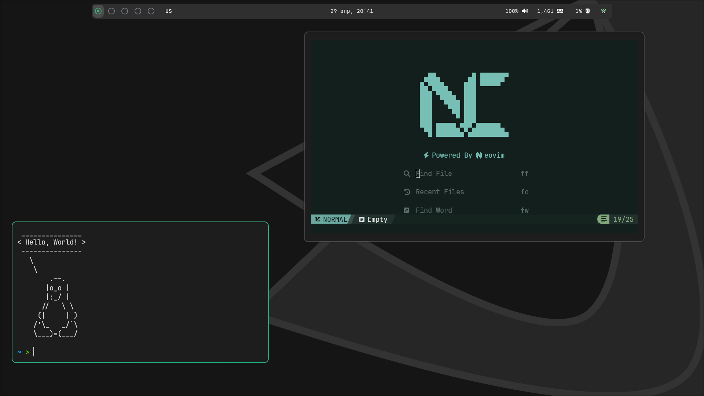
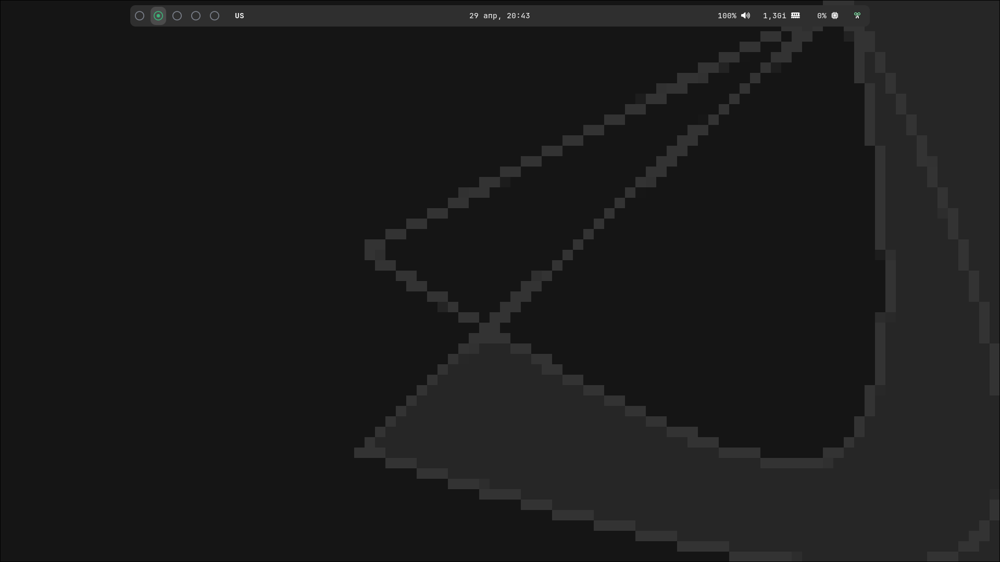

# 🪪 Основная часть

> [!WARNING]
> Проект больше не развивается

<p align=center>
    <a href="https://github.com/devmoded/hyprland-dots/blob/main/README.md">
        
    </a>
    &nbsp&nbsp&nbsp
    <a href="https://github.com/devmoded/hyprland-dots/blob/main/README-en.md">
        
    </a>
</p>

## Программы
🎛️ **Панель:** `waybar` (Использовались конфиги от [Andrey0189/hyprland-rice](https://github.com/Andrey0189/hyprland-rice) и [lgaboury/Sway-Waybar-Install-Script](https://github.com/lgaboury/Sway-Waybar-Install-Script/tree/master/.config/waybar))<br>
🖥️ **Дисплей менеджер:** `sddm` (Использовался конфиг от [JaKooLit/simple-sddm](https://github.com/JaKooLit/simple-sddm/tree/main))<br>
💻 **Терминал:** `kitty`<br>
🗃️ **Файловый менеджер:** `nemo`<br>
📹 **Видеоплеер:** `vlc`<br>
⌨️ **Редактор кода:** `zed`, `neovim`<br>

## Содержание
- [Скриншоты](#%EF%B8%8F-скриншоты)
- [Установка, настройка](#%EF%B8%8F-установка-настройка)
- [Требуемые пакеты](#требуемые-пакеты)
- [Совет](#если)

## 🖼️ Скриншоты




# ⚙️ Установка, настройка

## Установка всего:

```bash
sudo pacman -S hyprland waybar wofi kitty hyprpaper hyprlock nemo nwg-look swaync hyprpolkitagent xdg-desktop-portal-hyprland
sudo pacman -S nvim zed obsidian obs-studio steam telegram-desktop loupe cool-retro-term xreader libreoffice-fresh libreoffice-fresh-ru btop timeshift fastfetch vlc
sudo pacman -S noto-fonts noto-fonts-extra noto-fonts-emoji ttf-font-awesome otf-font-awesome ttf-jetbrains-mono ttf-jetbrains-mono-nerd ttf-montserrat otf-montserrat
sudo pacman -S sddm
systemctl enable sddm
sudo pacman -S qt5-quickcontrols2 qt5-graphicaleffects qt5-svg
git clone https://github.com/JaKooLit/simple-sddm.git ~/simple-sddm
sudo mv ~/simple-sddm /usr/share/sddm/themes/
git clone https://github.com/devmoded/hyprland-dots.git
cd hyprland-dots
mv .hdotsfiles $HOME
mv .icons $HOME
mv .config $HOME/.config
sudo cp $HOME/.hdotsfiles/wallpapers/dark/2.png /usr/share/sddm/themes/Backgrounds/eos_dark.png
pacman -S papirus-icon-theme
yay -S hyprshot wlogout
git clone https://github.com/NvChad/starter ~/.config/nvim && nvim
```
*\* Подробные инструкции по настройке ниже*
<br>
*\*\* Требуется также установить тему [orchis-theme](#orchis-green-dark)*

---

### Описание:

#### Необходимые и другие пакеты:

```bash
sudo pacman -S hyprland waybar wofi kitty hyprpaper hyprlock nemo nwg-look swaync hyprpolkitagent xdg-desktop-portal-hyprland
sudo pacman -S nvim zed obsidian obs-studio steam telegram-desktop loupe cool-retro-term xreader libreoffice-fresh libreoffice-fresh-ru btop timeshift fastfetch vlc
sudo pacman -S noto-fonts noto-fonts-extra noto-fonts-emoji ttf-font-awesome otf-font-awesome ttf-jetbrains-mono ttf-jetbrains-mono-nerd ttf-montserrat otf-montserrat
```

#### SDDM:

```bash
sudo pacman -S sddm
systemctl enable sddm
sudo pacman -S qt5-quickcontrols2 qt5-graphicaleffects qt5-svg
git clone https://github.com/JaKooLit/simple-sddm.git ~/simple-sddm
sudo mv ~/simple-sddm /usr/share/sddm/themes/
```

#### Дотфайлы:

```bash
git clone https://github.com/devmoded/hyprland-dots.git
cd hyprland-dots
mv .hdotsfiles $HOME
mv .icons $HOME
mv .config $HOME/.config
sudo cp $HOME/.hdotsfiles/wallpapers/dark/2.png /usr/share/sddm/themes/Backgrounds/eos_dark.png
```

#### Другое:

```bash
pacman -S papirus-icon-theme
yay -S hyprshot wlogout
git clone https://github.com/NvChad/starter ~/.config/nvim && nvim
```

## Требуемые пакеты:
### Основные
Hyprland, Waybar, Wofi, Kitty, Hyprpaper, Hyprlock, Nemo, nwg-look, swaync, hyprpolkitagent, xdg-desktop-portal-hyprland:
```bash
sudo pacman -S hyprland waybar wofi kitty hyprpaper hyprlock nemo nwg-look swaync hyprpolkitagent xdg-desktop-portal-hyprland
```
### Дополнительные
NeoVim, Zed, Obsidian, OBS Studio, Steam, Telegram, Loupe, Cool Retro Term, Xreader, LibreOffice, Btop, Timeshift, Fastfetch, VLC:
```bash
sudo pacman -S nvim zed obsidian obs-studio steam telegram-desktop loupe cool-retro-term xreader libreoffice-fresh libreoffice-fresh-ru btop timeshift fastfetch vlc
```

### Шрифты:
```bash
sudo pacman -S noto-fonts noto-fonts-extra noto-fonts-emoji ttf-font-awesome otf-font-awesome ttf-jetbrains-mono ttf-jetbrains-mono-nerd ttf-montserrat otf-montserrat
```

---

### SDDM:
```bash
sudo pacman -S sddm
systemctl enable sddm
```

#### **Установка темы SDDM**:

Для SDDM используется тема [simple-sddm](https://github.com/JaKooLit/simple-sddm/tree/main)

Установить `qt5-quickcontrols2, qt5-graphicaleffects, qt5-svg`

```bash
sudo pacman -S qt5-quickcontrols2 qt5-graphicaleffects qt5-svg
```

1. Открыть терминал и ввести:
```bash
git clone https://github.com/JaKooLit/simple-sddm.git ~/simple-sddm
```
2. Перенести:
```bash
sudo mv ~/simple-sddm /usr/share/sddm/themes/
```
3. Поставить тему в конфиге SDDM:
```bash
sudo nano /usr/lib/sddm/sddm.conf.d/default.conf
---

[Theme]
Current=simple-sddm
...
```

#### **Настройка темы SDDM**:

```bash
sudo cp $HOME/.hdotsfiles/wallpapers/dark/2.png /usr/share/sddm/themes/Backgrounds/eos_dark.png
```

```bash
sudo nano /usr/share/sddm/themes/simple-sddm/theme.conf
---

[General]
Background="Backgrounds/eos_dark.png"
...
MainColor="#3cb478"
...
AccentColor="#3cb478"
...
BackgroundColor="#151515"
```

---

### papirus-icon-theme:
```bash
pacman -S papirus-icon-theme
```

Установить [papirus-folders](https://github.com/PapirusDevelopmentTeam/papirus-folders?tab=readme-ov-file#papirus-installer) в HOME
```bash
papirus-folders -C green
```

### orchis-green-dark:
Установить [orchis-theme](https://github.com/vinceliuice/Orchis-theme)
```bash
./install -t green
```

---

### [Hyprshot](https://github.com/Gustash/Hyprshot):
```bash
yay -S hyprshot
```

### [wlogout](https://github.com/ArtsyMacaw/wlogout):
```bash
yay -S wlogout
```

---

### NeoVim:
Используется [NvChad](https://nvchad.com/)
```bash
git clone https://github.com/NvChad/starter ~/.config/nvim && nvim
```
```nvim
:MasonInstallAll
```
Удалить каталог `.git` из `.config/nvim/`

---

# Если:
## Приложения в wofi открываются через xterm:
В `/usr/share/applications/` найти `.desktop` файл нужного приложения и в строке
```bash
...
Exec=*kitty <и команда для выполнения (например: vim)>
Terminal=false
```
\**(например kitty)*
